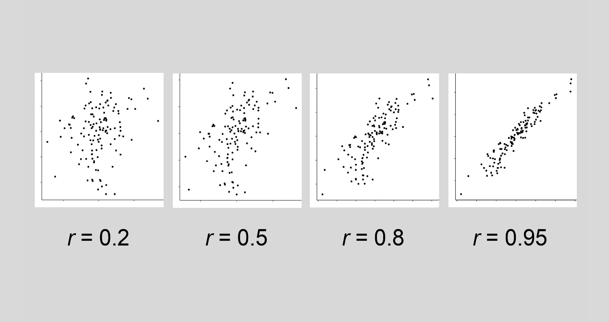
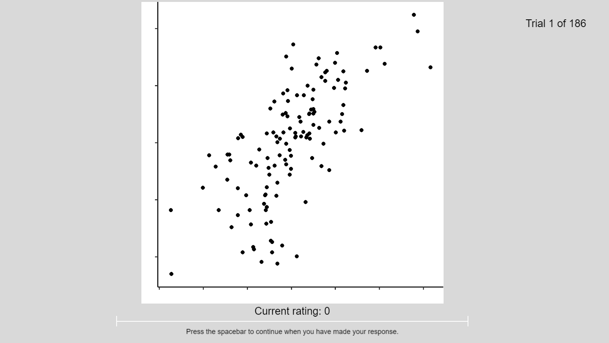

```{r setup, include=FALSE}
knitr::opts_chunk$set(echo = TRUE)
# Knitting this document requires tinytex (install.packages("tinytex"))
# For formatting to be correct, additional tinytex packages are required
# Run tinytex:::install_yihui_pkgs() before knitting
```

```{r, include=FALSE}
set.seed(1234) # seed for all random number generation

# Loading packages
library(rticles)
library(tidyverse)
library(MASS)
library(emmeans)
library(scales)
library(buildmer)
library(lme4)
library(kableExtra)
library(afex)
library(papaja)
library(broom.mixed)
library(insight)
library(qwraps2)
library(lmerTest)
library(tinylabels)
library(EMAtools)
library(ggdist)
library(ggpubr)
library(pwr)
library(geomtextpath)

# Comment out the following line if additional tinytex packages are already installed
#tinytex:::install_yihui_pkgs()
```

```{r eval-models, include=FALSE}
# in this script, models are cached. If eval_models <- FALSE, script will load
# cached models. Set eval_models <- TRUE to rebuild models from scratch
eval_models <- TRUE

if (eval_models == FALSE){
  lazyload_cache_dir('contrast_and_scatterplots_cache/latex')
}
```

```{r load-data, include=FALSE}
# load in data files
contrast1_anon <- read_csv("data/data_E1_uniform_adjustments.csv")
contrast2_anon <- read_csv("data/data_E2_spatially_dependent.csv")
```

```{r wrangle, include = FALSE}
# function for wrangling data
wrangle <- function(anon_file) {
  
  literacy <- anon_file %>%
    filter(!is.na(q1_slider.response)) %>%
    rowwise() %>%
    mutate(literacy = sum(c(q1_slider.response, 
                            q2_slider.response, 
                            q3_slider.response, 
                            q4_slider.response, 
                            q5_slider.response))) %>%
    dplyr::select(participant,
           literacy)
  
# extract demographic information
# link slider response numbers to gender categories
  
demographics <- anon_file %>%
  filter(!is.na(gender_slider.response)) %>%
  mutate(gender_slider.response = recode(gender_slider.response,
                                         `1` = "F",
                                         `2` = "M",
                                         `3` = "NB")) %>%
  dplyr::select(matches(c("participant",
                          "age_textbox.text",
                          "gender_slider.response")))

# split plots_with_labels column into item and contrast condition columns 

anon_file <- anon_file %>%
  mutate(images = str_replace(images, pattern = "A", replacement = "-A")) %>%
  mutate(images = str_replace(images, pattern = "B", replacement = "-B")) %>%
  mutate(images = str_replace(images, pattern = "C", replacement = "-C")) %>%
  mutate(images = str_replace(images, pattern = "D", replacement = "-D")) %>%
  separate(images, c("item", "contrast"), sep = "-") %>%
  mutate(contrast = str_replace(contrast, pattern = ".png", replacement = "")) %>%
  mutate(item = str_replace(item, pattern = "all_plots/", replacement = ""))

# select relevant columns
# select only experimental items
# add literacy data
# change data types where appropriate
# output this file with suffix 'tidy'

anon_file %>%
  dplyr::select(c("participant",
                  "item",
                  "contrast",
                  "slider.response",
                  "my_rs",
                  "total_residuals",
                  "unique_item_no",
                  "trials.thisN",
                  "session")) %>%
  mutate(half = case_when(
    trials.thisN < 93 ~ "First",
    trials.thisN > 92 ~ "Second" )) %>%
  filter(unique_item_no < 181) %>%
  inner_join(literacy, by = "participant") %>%
  inner_join(demographics, by = "participant") %>%
  mutate(across(c("item", "contrast", "half"), as_factor)) %>%
  dplyr::select(-c("__participant")) %>%
  mutate(difference = my_rs - slider.response) %>%
  mutate(contrast = fct_relevel(contrast, c('A', 'B', 'C', 'D'))) %>% 

  assign(paste0(unique(anon_file$expName), "_tidy"),
           value = ., envir = .GlobalEnv)
}

# use wrangle function on anonmyised data files 

walk(list(contrast1_anon,
          contrast2_anon),
     wrangle)

# Experiments were incorrectly named, so rename them

E1_uniform_adjustments_tidy <- E3_full_exp_tidy
E2_spatially_dependent_tidy <- E2_full_exp_tidy

# remove incorrectly named and anon dfs from environment

rm(E3_full_exp_tidy, E2_full_exp_tidy, contrast1_anon, contrast2_anon, wrangle)

# check for missing age values

sum(is.na(E1_uniform_adjustments_tidy$age_textbox.text))
sum(is.na(E2_spatially_dependent_tidy$age_textbox.text))

# print sessions with missing age values

E2_spatially_dependent_tidy %>%
  filter(is.na(age_textbox.text)) %>%
  distinct(session)

# no missing values in E1, some in E2.
# fill in missing age values from prolific_data.csv
# we can't include this as it contains personally
# identifiable Prolific IDs
#missing_age_a <- prolific_data %>%
#  filter(session == "_") %>%
#  pull(age_textbox.text)
#missing_age_b <- prolific_data %>%
#  filter(session == "_") %>%
#  pull(age_textbox.text)
#E2_spatially_dependent_tidy <- E2_spatially_dependent_tidy %>%
#  mutate(age_textbox.text = case_when(
#    session == "_" ~ missing_age_a,
#    session == "_" ~ missing_age_b,
#    TRUE ~ as.numeric(as.character(age_textbox.text))
#  ))
```

```{r comparison-function, include=FALSE}
# this function takes a model and creates a nested model with the fixed effects 
# term removed for anova comparison
comparison <- function(model) {
  
  parens <- function(x) paste0("(",x,")")
  onlyBars <- function(form) reformulate(sapply(findbars(form),
                                              function(x)  parens(deparse(x))),
                                       response=".")
  onlyBars(formula(model))
  cmpr_model <- update(model,onlyBars(formula(model)))
  
  return(cmpr_model)
  
}
```

```{r anova-results-function, include=FALSE}
# this function takes two nested models, runs an anova, and the outputs the 
# Chi-square statistic, the degrees of freedom, and the p value to the global environment
anova_results <- function(model, cmpr_model) {
  
  model_name <- deparse(substitute(model))
  
  if (class(model) == "buildmer") model <- model@model
  if (class(cmpr_model) == "buildmer") cmpr_model <- cmpr_model@model
  
  anova_output <- anova(model, cmpr_model)
  
  assign(paste0(model_name, ".Chisq"),
         anova_output$Chisq[2],
         envir = .GlobalEnv)
  assign(paste0(model_name, ".df"),
         anova_output$Df[2],
         envir = .GlobalEnv)
  assign(paste0(model_name, ".p"),
         anova_output$`Pr(>Chisq)`[2],
         envir = .GlobalEnv)
  
}
```

```{r contrasts-extract, echo=FALSE}
# this function extracts test statistics and p values from model summaries
contrasts_extract <- function(model) {
  
  model_name <- deparse(substitute(model))
  
  if (class(model) == "buildmer") model <- model@model
  
  EMMs <- emmeans(model, pairwise ~ contrast)
  
  params <- as.data.frame(EMMs[2]) %>%
                            rename_with(str_replace,
                                        pattern = "contrasts.", replacement = "",
                                        matches("contrasts")) %>%
                            rename_with(str_to_title, !starts_with("p")) %>%
                            dplyr::select(c("Contrast", "Z.ratio", "p.value"))
  
  return(params)
  
}
```

```{r effect-size-function, include = FALSE}
get_effects_sizes <- function(model, d) {
  
  effect_sizes <- lme.dscore(model, data = d, type = "lme4")
  
  effects_df <- as.data.frame(effect_sizes[3])
  
  return(effects_df)
}
```

```{r dot-plot-function, include = FALSE}
dot_plot_function <- function(df) {

data <- df %>%
  group_by(contrast) %>%
  filter(!is.na(difference)) %>%
  filter(!is.na(contrast)) %>%
  summarise(
    mean = mean(difference),
    lci = t.test(difference, conf.level = 0.95)$conf.int[1],
    hci = t.test(difference, conf.level = 0.95)$conf.int[2],
  )

  data %>%
    mutate(contrast = fct_relevel(contrast, "A", "B", "C", "D")) %>%
    ggplot(aes(x = contrast, y = mean)) +
    geom_point() +
    #coord_cartesian(ylim = c(0, max_error))
    geom_errorbar(aes(ymin=lci, ymax=hci), colour="black", width=0.05, linewidth =1) +
    theme_ggdist() +
    labs(x = "Contrast Condition",
         y = "Mean Error") +
    theme(axis.text = element_text(size = 13),
          axis.title = element_text(size = 16))
}
```

```{r plot-sd-sd, include = FALSE}
plot_sd_sd_function <- function(df){
  df %>% 
  summarise(ppt_sd = sd(difference)) %>% 
  drop_na() %>% 
  group_by(contrast) %>% 
  summarise(mean_sd = mean(ppt_sd), sd_sd = sd(ppt_sd)) %>% 
  ggplot(aes(x = contrast, y = mean_sd)) +
  geom_point(size = 2) + 
  geom_errorbar(aes(ymin = mean_sd - sd_sd, ymax = mean_sd + sd_sd), width = 0.05, linewidth = 1) + 
  theme_ggdist() +
  ylim(0, .3) +
  labs(x = "Contrast Condition",
       y = "Mean Standard Deviation") +
        theme(axis.text = element_text(size = 13),
              axis.title = element_text(size = 16))
}
```

```{r error-bar-plot, include = FALSE}
plot_error_bars_function <- function(df, measure, l){
  df %>% 
  drop_na() %>% 
  group_by(contrast, my_rs) %>% 
  summarise(sd = sd(get(measure)), mean = mean(get(measure))) %>% 
  ggplot(aes(x = my_rs, y = mean)) +
  geom_point(size = 0.2) + 
  geom_errorbar(mapping = aes(ymin = mean + sd, ymax = mean - sd),width = 0.01, size = 0.3) +
  geom_hline(yintercept = 0, linetype = 2) +
  theme_ggdist() +
  theme(strip.text = element_text(size = 6, margin = margin(1,0,1,0, "mm"))) +
  facet_wrap(contrast ~., ncol = 4, labeller = labeller(contrast = l)) +
    labs(x = "Objective r",
         y = "Mean r estimation")
}

```

```{r labeller, include = FALSE}
labels_e1 <- c(A = "Low Contrast", B = "Medium Contrast", C = "High Contrast", D = "Full Contrast")
labels_e2 <- c(A = "Non-Linear Decay", B = "Linear Decay", C = "Inverted Decay", D = "Full Contrast")
```

This submission is approximately 7700 words.

# Introduction

In one form or another, data visualizations have been used for thousands of years
to aid analysis, to supplement narrative prose, and to communicate ideas [@azzam_2013].
Where once they were the preserve of those working directly with data, it is now
expected that most professionals, and indeed many members of the public, are comfortable
and familiar with an array of different data visualizations. The widespread adoption of
data visualizations is positive for science as effective data visualizations can aid
communication, but it also brings with it obligations, not only to design and communicate with honesty,
but also to study how people understand and work with data visualizations.

In the last two centuries, the use of data visualizations has become increasingly 
common [@friendly_2005; @azzam_2013]. The speed of the adoption of visualizations has 
meant rigorous scientific study of how they are comprehended by a viewer
has often failed to keep pace. For many people, the COVID-19 pandemic has made
data visualizations an everyday phenomenon (see \citealp{bbc_2022}, 
for examples of the types of visualizations many saw daily). As data visualization 
designers, we have a duty to design in such a way that viewers with little to no formal statistical
or data training can understand the message that visualizations are trying to convey.

In this paper we present a novel visualization technique that significantly increases
the accuracy of people's performance on a correlation estimation task. In our first experiment, we show
that manipulating the contrast of scatterplot points can bias participants' estimates
of correlation. In our second we leverage this effect to partially correct for a systematic
underestimation by viewers of correlations in scatterplots that has a long-standing basis 
in the literature. Through this work we also present a framework for the effective, inexpensive,
and high-powered study of data visualizations.

## Why Study Scatterplots?

Scatterplots, estimated in 1983 to account for between 70 and 80 percent of data visualizations
in scientific publications [@tufte_1983], are simple representations of bivariate
data that people generally interpret in the same way [@kay_heer_2015].
@rensink_2014 identifies them as similar to a fruit fly for geneticists; 
simple enough to be easily studied, but complex enough to provide interesting
insights. These features make them ideal candidates for controlled, empirical study,
in addition to providing us with insights into visualization design and perception.
Designers of data visualizations have a duty to design in such a way that viewers
with limited statistical, data, or graph training can be expected to correctly interpret
the messages that visualizations are trying to convey. It is for this reason that
we have chosen our population; lay participants with varying levels of statistical
training and graph literacy, as these are the people that we should be designing for.

# Related Work

## Testing Correlation Perception {#testing}

The most intensively studied aspect of scatterplots is correlation perception, (i.e. the strength of
the relationship between two variables), although they are used for a wide variety of
other tasks, including cluster separation, outlier detection, and trend identification [@behrisch_2021].
Throughout this paper we refer to an *r* value, or the Pearson product moment correlation coefficient. Pearson's *r* takes a 
value between 0 and |1|, and is positive or negative depending on the direction of 
the relationship between the two variables in question.

Scatterplots have been extensively studied in a variety of experimental paradigms.
Very early work [@pollack_1960] asked participants to make discriminative judgements
between scatterplots with different correlations, and found that people were
more easily able to discriminate as the magnitude of the *r* value increased.
Subsequent work focused on asking participants to provide a numerical estimate of
the *r* value, with studies finding evidence for a systematic underestimation for
positive *r* values apart from 0 and 1. In several studies this effect was particularly
pronounced for 0.2 < *r* < 0.6 [@strahan_1978; @bobko_1979; @cleveland_1982;
@lane_1985; @lauer_1989; @collyer_1990; @meyer_1992], see Figure 
\ref{underestimation-curve} for an approximation of the underestimation observed.
\citet{micallef_2017} test an automated system for varying scatterplot aspect ratio, point size, 
and point contrast, finding that a 1:1 aspect ratio produces the best performance on
a correlation estimation task, and reporting no effect of adjusting point size or contrast,
although this was carried out uniformly to deal with overplotting issues. In addition to studies
employing discriminative judgement or direct estimation tasks, several more recent
investigations have employed a combination of bisection tasks, in which participants
are asked to adjust a test plot so that its correlation is halfway between two
reference plots, and a staircase discriminative judgement task that allows 
researchers to find the just-noticeable-difference (JND) between scatterplots
such that their correlations are distinguishable 75% of the time. This novel approach
[@rensink_2010] allowed researchers to obtain measurements for participants'
precision and accuracy in correlation estimation, and to begin to fit mathematical
models that describe the relationship between objective and perceived correlation.
Given that this paper seeks to provide design guidelines, and is interested in comparative,
naturalistic judgements of correlation, we have elected to use a direct estimation paradigm.

```{r underestimation-curve, warning=FALSE, echo=FALSE, message=FALSE, fig.cap="\\label{underestimation-curve}Using a function that relates objective to subjective \\textit{r}\ supplied in \\cite{rensink_2017}\ allows us to visualize the nature of the underestimation curve found in correlation perception studies. The curve represents the underestimation of correlation.", fig.height=3.2, fig.width=3.2, fig.align='left', description = "A line graph, with objective r value on the horizontal axis, and subjective r value on the vertical axis. A curve describes the relationship between the two variables, which are similar at r = 0 or 1. The curve shows how r is underestimated in the midrange, reaching maximum underestimation around r = 0.6."}
my_rs <- seq(from = 0, to = 1, length.out = 100)
as_tibble(my_rs) %>%
  mutate(under_est = (log(1-0.88*my_rs)/log(1-0.88))) %>%
  ggplot() +
  geom_smooth(aes(x = my_rs, y = under_est)) +
  ylim(0,1) +
  xlim(0,1) +
  theme_minimal() +
  labs(x = "Objective r value",
       y = "Subjective r value")
```

## What Drives Correlation Perception?

Several key pieces of evidence point to correlation perception being driven
by the shape of the probability distribution relayed by the points.
A study investigating the effect of increasing the $x$ and $y$ scales on scatterplots
(thereby decreasing the size of the point cloud, \citealp{cleveland_1982}) found that 
a viewer's judged association increased as the size of the point cloud decreased, despite
the *r* value remaining the same between conditions. The authors suggest
this may be due to participants using the area of the point cloud, or the ratio
of the minor and major axes of it, to judge association. Decreasing the size of
the point cloud here also had the effect of narrowing the width of the 
distribution displayed, as the length of the minor axis decreased.

Another study asked participants to provide estimates of correlation in scatterplots
[@meyer_1997]. It found that the relationship between objective and perceived
*r* values could be accurately described by a function that included the mean
of the geometrical distances between the points and the regression line. This
is intuitive, as scatterplots with higher correlation will generally have lower average
distances between their points and the regression line. 

A more recent study investigating the hypothesis that people use visual features
to judge correlation [@yang_2019] found evidence that several visual features
were predictive of correlation estimation performance.
Among these was the standard deviation of all perpendicular distances from the points to the regression line,
a quantity similar to that in @meyer_1997, which on an individual level
was more predictive of participants' estimates of correlation than the objective
*r* value itself.

Bringing together work that has sought to model the relationship between objective
and perceived *r* values, @rensink_2017 notes that equations for both
discrimination and magnitude estimation include a parameter, termed *u*,
that is small when *r* = 1, and increases as *r* approaches 0. The utility of this 
parameter in modelling correlation perception is indifferent to the type of data visualization used, which
implies that the width of the probability distribution, summarised by the aforementioned
parameter, is key to how people estimate correlation. Within the context of scatterplots
however, this parameter can also be expressed as the average distance between the points
and the regression line (the *X* parameter in \citealp{meyer_1997}).

None of the above is proof that people are using *only* the mean or standard 
deviation of geometrical distances between the points and the regression line to
estimate correlation. However, taken with findings that correlation is perceived 
rapidly by viewers [@rensink_2014], what we have discussed thus far suggests that this parameter
is at least a good proxy for what people are really attending to, insofar as changing it has
the ability to influence how people estimate correlation. From this evidence, a 
good candidate for influencing people's perceptions of correlation is changing
the perceived width of this probability distribution by changing the perceived distance
between points and the regression line.

## Transparency

Adjusting the contrast in scatterplots has been used extensively to solve
problems of overplotting or clutter [@matejka_2015; @bertini_2004], in which scatterplots with very large numbers 
of data points suffer from visibility issues caused by excessive point density. 
Lowering the contrast of all points makes the underlying distributions and trends
much easier to discern for the user. Increasing the transparency leads to a reduction of the contrast of isolated points with the background, and for regions with overlapping points color intensities are summed. Our stimuli had only 128 small points, meaning
the majority of points were clearly visible at all times, and we do not consider the 
small degree of overlap problematic. For this reason, and due to
the fundamentality of contrast as a feature of human visual perception [@ginsburg_2003] we
elected to use the term contrast to describe our point manipulations. The approach we
describe may not be useful with much larger datasets where clutter becomes problematic.

## Contrast  

Despite the popularity of adjusting contrast to address overplotting issues,
little investigation has taken place into the effects of reducing point contrast
on people's perceptions of correlation; what has been found is that correlation perception
seems to be invariant to changes in point contrast [@rensink_2012], although this work
took place with small sample sizes (n = 12), and using only bisection/JND methodologies.

Changing the contrast of a visual stimulus effectively reduces the strength of that
signal. A likely consequence of this is increased uncertainty in aspects of that stimulus,
for example the locations of points in scatterplots. Consequently, one might anticipate 
that increased noise could lead to altered perception of correlation and/or more
noise in correlation estimates due to effects on the perceived position of points within the cloud.
While there is indeed evidence [@wehrhahn_1990] that the perception of stimulus position
becomes exponentially worse as contrast is reduced (as measured by vernier acuity tasks),
this is only true for a narrow range of low contrasts just above the detection threshold.
For higher contrasts vernier acuity appears largely robust to such changes. Nonetheless,
there is clear evidence that other perceptual estimates become more uncertain with
reduced contrast, for example speed perception [@champion_2017]. With this in mind,
and the relatively small sample size used in @rensink_2012, we suggest that the effects
of contrast on perceived correlation warrant further investigation.

A recent study [@hong_2021] used contrast and size to encode a third variable
in trivariate scatterplots. The authors then asked participants to use a mouse
to click on the average position of all the points displayed. They found that participants'
estimates of average point position were biased towards larger or darker points,
which the authors term the *weighted average illusion*. Together with evidence
that darker and larger points are more salient [@healey_2012], this implies that we
can use contrast to reduce the salience of the points representing the widest parts 
of the probability distribution; if this is successful, and participants perceive
a narrower distribution, we would expect this to be able to correct for a viewer's underestimation bias.

One way to correct for an underestimation in correlation would be to simply remove 
outer data points until correlation perception is aligned with the actual correlation value. However, 
this would necessitate hiding data and thus changing the information presented to the viewer.
An alternative approach is to manipulate the contrast of only some of the points;
it would seem most sensible to do so for the
points that are more extreme relative to the underlying regression line.

In the present study we address the issues raised above in two online experiments
with large sample sizes. In the first we consider the effects of point contrast
over the entire scatterplot on correlation estimates. In the second experiment
we examine how changing contrast as a function of distance to the regression
line affects perceived correlation. To pre-empt our results we find clear effects
of both manipulations.

# General Methods

## Formalising Contrast

We use the **ggplot2** [@hadley_gg2016] package for plot creation in both experiments,
which uses an alpha parameter to set contrast. Alpha here refers to the 
linear interpolation [@stone_2008] between foreground and background pixel values; 
alpha values of 0 (full transparency) and 1 (full opacity) result in no interpolation
and rendering of either the background or foreground pixel values respectively.
Alpha values between 0 and 1 correspond to different ratios of interpolation between
foreground and background pixel values.

There are numerous psychophysical definitions of perceived contrast [@zuffi_2007]
based on what is being presented, for example models that take into account visibility limits (CIELAB lightness), and
contrast in periodic patterns such as sinusoidal gratings (Michelson's contrast).
The common thread running through these definitions is the use of the ratio
between target and background luminances. Our experiment was fully online, with
participants completing it on their personal laptop or desktop computers. This meant
we had no control over the exact luminances of our stimuli, only over the *relative*
luminance between targets (scatterplot points) and backgrounds. Given that we are
interested in *relative* differences in correlation perception averaged over a series
of 180 single-plot presentation trials, we do not 
consider this a shortcoming. In light of this however, it would be inappropriate to
report absolute luminance values. Instead, we simply report the alpha value, which
is representative of the luminance ratio. Figure \ref{formal-contrast} 
illustrates the contrasts created by alpha values between 0 and 1. For clarity, 
we henceforth refer to the alpha value as "contrast alpha" throughout.

```{r formal-contrast, warning=FALSE, echo=FALSE, fig.cap="\\label{formal-contrast}Higher alpha values result in greater contrast between the foreground (scatterplot point) and background. When alpha = 0, the foreground is ignored and the background is rendered.", out.width="50%", fig.align='left', fig.height=2, description = "Shows how contrast between a black point and a white background changes with the value of the alpha parameter. The point gradually becomes darker, going from transparent at alpha = 0 to fully opaque at alpha = 1."}
x1 <- seq(0,1, length.out = 11)
y1 <- rep(1, times = 11)
df <- data.frame(x1, y1)
ggplot(aes(x1, y1), data = df) +
  geom_point(alpha = x1, size = 18, shape = 16) +
  theme(panel.background = element_blank(),
        axis.ticks = element_blank(),
        axis.text.y = element_blank(),
        axis.title = element_blank(),
        plot.title = element_text(size = 16),
        axis.text.x = element_text(size = 14)) +
  scale_x_continuous(breaks = scales::pretty_breaks(n = 11)) +
  labs(title = "Effect of Alpha Values on Point Appearance")
rm(x1,y1,df)
```

## Overview of Experiments

Experiments 1 and 2 share multiple aspects of their procedures. Both experiments were 
built using PsychoPy [@pierce_psychopy_2019], and hosted on
pavlovia.org. Both use 1-factor, 4-level designs. Participants were only permitted to complete the experiments on
a desktop computer or laptop. As with the luminances of scatterplots and their
points, our crowd-sourced approach renders the measurement of participant-to-monitor 
distance and the recording of exact apparatus impossible. We do not consider this a 
shortcoming however, as it allows for findings that are robust to various displays and
viewing contexts and allows us to make conclusions that are of particular relevance
to the HCI audience.

Ethical approval for both experiments was granted by the University of Manchester’s
Computer Science Department Panel (Ref: 2022-14660-24397). Each participant was shown
the participant information sheet (PIS) and provided consent through key presses in 
response to consent statements. They were then asked to provide their age in a free text box,
and their gender identity. Following this they were asked to complete the 5-item Subjective
Graph Literacy (SGL) test [@garcia_2016]. Participants were then shown 7 instructional
slides that can be seen in the 
experimental repository (https://gitlab.pavlovia.org/Strain/exp_uniform_adjustments/blob/master/instructions.csv).
Ad-hoc piloting with a graduate student in humanities suggested people might be unfamiliar with what different correlations
looked like in scatterplots. They were therefore shown examples of *r* = 0.2, 0.5,
0.8, and 0.95, which can be see in Figure \ref{example-plots}. See Section \ref{training} for
a discussion of the potential effects of this. Participants 
were then given two practice trials before the experiment began.

```{r example-plots,echo = FALSE,fig.cap="\\label{example-plots}Participants viewed this for at least 8 seconds before being allowed to continue onto the practice trials.", fig.align='left', out.width="50%", description = "Sample of experiment 1 showing example scatterplots. Four plots are shown, with r values of 0.2, 0.5, 0.8, and 0.95."}

```

Each trial was preceded by text that either told the participant "Please look at
the following plot and use the slider to estimate the correlation" (in black,
experimental trial), or "Please IGNORE the correlation displayed and set the slider
to 1"[^1] (n = 3) or "Please IGNORE the correlation displayed and set the slider
to 0" (n = 3) (in red, attention check trial). Each plot was preceded by a visual mask displayed 
for 2.5 seconds. Figure \ref{example-trial} shows an example of an experimental 
trial. There was no time limit per trial, but participants were instructed to make
their judgements as accurately and quickly as possible.

[^1]: The word "ignore" was in lowercase in the first experiment, but was changed
  to uppercase in the second to increase the salience of attention check items.

Both experiments described here use a fully repeated measures, within-participants design.
Participants saw all 180 plots, corresponding to ~ 27,000 individual judgements per experiment.
Presentation order was randomised. 

```{r example-trial, echo=FALSE, fig.align='left', out.width="50%", fig.cap="\\label{example-trial}An example of an experimental trial.", description = "Trial scatterplot is in the centre, with a slider below it. The slider has `Current rating: 0` written above it, and `Press the spacebar when you have made your response` written below."}

```

## Plot Generation

Scatterplots were randomly generated from bivariate normal distributions, having a
standard deviation of 1 in each direction. All plots presented
were 1200 * 1200 pixels in size, and included no titles, tick labels, or axis labels.
Points were 10 pixels in diameter on a 1280x720 resolution monitor, and 13 pixels in
diameter on a 1920x1080 resolution monitor. All plots displayed in both experiments
had a 1:1 aspect ratio. Due to our crowdsourced approach we were
unable to obtain monitor resolution or physical screen size measurements for 
We are however working on a method to accomplish this in future work. 
Each plot contained 128 data points. 45 *r* values were generated on a uniform distribution
between 0.2 and 0.95. The same dataset was used for plot
generation in both experiments. We chose these boundaries due to evidence that very little
correlation is perceived below 0.2 [@bobko_1979; @cleveland_1982; @strahan_1978].
Scripts detailing item and mask creation for each experiment can be found in the
item_preparation folder.

# Open Research Statement

Both experiments were conducted according to the principles of open and reproducible 
research. All data and analysis code are available at https://github.com/gjpstrain/contrast_and_scatterplots.
This repository contains instructions for building a Docker container that fully reproduces
the computational environment this paper was written in, allowing for a full recreation
of both stimulus generation and the paper itself. Both experiments
and their related hypotheses and analysis plans were pre-registered with the OSF
(https://osf.io/v23e9/), and there were no deviations from them. We used linear mixed-effects
models to model the relationships between our independent variables (point contrast
in experiment 1 and the type of contrast decay function in experiment 2) and our dependent variable
(participants' estimates of correlation). Linear mixed-effects models allow us to
compare differences between levels of our independent variable across the full range of participant responses
on the dependent variable, as opposed to simply analysing the differences between means
that would be afforded to us with ANOVA. Linear mixed-effects models also allow us 
to include random effects for both participants and experimental items in our modelling. Consistent with 
our pre-registrations, we aimed for the most complex random effects structures when
producing models. The structure of these models was identified
using the **buildmer** package in R [@voeten_buildmer_2022]. This package takes the most 
complex random effects model, in terms of intercepts for participants and items and
corresponding slopes for fixed effects terms as an input. It then identifies the most complex
model that successfully converges, dropping terms that fail to explain a significant amount of variance, as
assessed with likelihood ratio tests. This provides a simple and reproducible methodology for the construction
of linear mixed-effects models. This approach does mean that the final model used is not always the most complex one 
possible, but rather is the most complex that substantially explains variance
and converges.

# Normality

```{r normality-plots, warning = FALSE, echo = FALSE, message = FALSE, fig.show = 'hold', fig.align='left', out.width="50%", fig.cap = "\\label{normality-plots}qqplots showing the distribution of errors in experiments 1 and 2."}
ggqqplot(E1_uniform_adjustments_tidy$difference, size = 0.75) + ggtitle("Experiment 1: Uniform Adjustments") +
  theme(plot.title = element_text(size = 18))

ggqqplot(E2_spatially_dependent_tidy$difference, size = 0.75) + ggtitle("Experiment 2: Spatially Dependent Adjustments") +
  theme(plot.title = element_text(size = 18))
```

Figure \ref{normality-plots} shows qqplots testing the normality of participants' errors
in correlation estimation for both experiments. While error is not entirely normally distributed, the size
of our sample renders this a non-issue with regards to statistical testing [@ghasemi_2012], so no
transform was used.

# Experiment 1: Changing the Contrast of All Points

## Introduction

Our first experiment varied the contrast of every point on a scatterplot in a
uniform manner. Given the effects of contrast on perception 
described above [@champion_2017;@wehrhahn_1990], we hypothesized that there would be a 
more variable spread of correlation estimates for plots with lower contrast compared to plots
with higher contrast, potentially due to the greater spatial uncertainty induced by
lower contrast.

## Method 

### Participants

```{r demographics_e1, echo=FALSE}
# extract age data
age_e1 <- distinct(E1_uniform_adjustments_tidy, participant,
                   .keep_all = TRUE) %>%
  summarise(mean = mean(age_textbox.text, na.rm = TRUE),
            sd = sd(age_textbox.text, na.rm = TRUE)) 
# extract gender data
gender_e1 <- distinct(E1_uniform_adjustments_tidy, participant,
                      .keep_all = TRUE) %>%
  group_by(gender_slider.response) %>%
  summarise(perc = n()/nrow(.)*100) %>%
  pivot_wider(names_from = gender_slider.response, values_from = perc)
# extract literacy data
literacy_e1 <- distinct(E1_uniform_adjustments_tidy, participant,
                        .keep_all = TRUE) %>%
  summarise(mean = mean(literacy), sd = sd(literacy))
```

150 participants were recruited using the Prolific.co platform. Normal to corrected-to-normal
vision and English fluency were required for participation. In accordance
with guidelines published in @peer_2021, participants were required to have 
previously completed at least 100 studies on Prolific, and were required to have
a Prolific score of at least 100, indicating acceptance on at least 100/101 studies previously completed. In addition, participants who had completed an earlier, similar study that was run by the authors of the current paper, were prevented from participating.

Data were collected from 158 participants. 8 failed more than 2 out of 6 
attention check questions, and, as per pre-registration stipulations, were rejected
from the study. The remaining 150 participants' data were included in the full
analysis (`r printnum(gender_e1$M)`% male, `r printnum(gender_e1$F)`% female, and 
`r printnum(gender_e1$NB)`% non-binary). Mean age of participants was `r printnum(age_e1$mean)`
(*SD* = `r printnum(age_e1$sd)`). Mean graph literacy score was `r printnum(literacy_e1$mean)`
(*SD* = `r printnum(literacy_e1$sd)`) out of 30. The average time taken to complete
the experiment was 33 minutes (SD = 10 minutes).

### Design

For each of the 45 *r* values there were 4 versions of each plot
corresponding to the 4 levels of point contrast, examples of which can be seen
in Figure \ref{e1-example-plots}. 

The experiment is hosted at 
https://gitlab.pavlovia.org/Strain/exp_uniform_adjustments.
This repository contains all the experimental code, materials, and instructions needed
to run the experiment in full.

```{r e1-example-plots, warning = FALSE, echo=FALSE, fig.align='left', out.width="50%", fig.asp=1, fig.show='hold', fig.cap="\\label{e1-example-plots}The four levels of the contrast condition in experiment 1, demonstrated with an \\textit{r} value of 0.6. Some points overlap, resulting in increased contrast in those areas.", description = "An array of four scatterplots. Top left has points with low contrast and is labelled `Contrast alpha = 0.25`. Top right plot has medium contrast (contrast alpha = 0.5). Bottom right has high contrast (contrast alpha = 0.75). Bottom right has full contrast (contrast alpha = 1)."}
  set.seed(1234)
  
  my_sample_size = 128
  
  my_desired_r = 0.6
  
  mean_variable_1 = 0
  sd_variable_1 = 1
  
  mean_variable_2 = 0
  sd_variable_2 = 1
  
  mu <- c(mean_variable_1, mean_variable_2) 
  
  myr <- my_desired_r * sqrt(sd_variable_1) * sqrt(sd_variable_2)
  
  mysigma <- matrix(c(sd_variable_1, myr, myr, sd_variable_2), 2, 2) 
  
  corr_data = as_tibble(mvrnorm(my_sample_size, mu, mysigma, empirical = TRUE))
  
  corr_model <- lm(V2 ~ V1, data = corr_data)
  
  my_residuals <- abs(residuals(corr_model))
  
  data_with_resid <- round(cbind(corr_data, my_residuals), 2)
  
plot_example_function <- function (d, x, t) {
  
  set.seed(1234)
  
  ggplot(d, aes(x = V1, y = V2)) +
  scale_alpha_identity() +
  geom_point(aes(alpha = x), shape = 16, size = 1)  +
  labs(x = "", y = "") +
  theme_classic() +
  theme(axis.text = element_blank(),
        plot.margin = unit(c(0,0,0,0), "cm"),
        legend.position = "none",
        plot.title = element_text(size = 15)) +
  labs(title = t)
  
}

ggarrange(plot_example_function(data_with_resid, 0.25, "Contrast Alpha = 0.25"),
          plot_example_function(data_with_resid, 0.5, "Contrast Alpha = 0.5"),
          plot_example_function(data_with_resid, 0.75, "Contrast Alpha = 0.75"),
          plot_example_function(data_with_resid, 1, "Contrast Alpha = 1"))
```

## Results

All analyses were conducted using R (version 4.2.2, \citealp{r_core}).
Models were built using the **buildmer** (version 2.8, \citealp{voeten_buildmer_2022}) and
**lme4** (version 1.1-31, \citealp{bates_lme4_2015}) packages, with contrast condition
being set as the predictor for participants' error in correlation estimates.

```{r e1-dot-plot, warning=FALSE, echo=FALSE, message=FALSE, fig.show='hold', fig.align='left', out.width = "50%", fig.cap="\\label{e1-dot-plot}Mean error in correlation estimation across the four contrast conditions in E1, with 95\\% confidence intervals shown.", description = "Dot plot showing mean estimation error for the four contrast conditions in experiment 1. Mean error gets smaller as we go from low to medium to high to full contrast. 95\\% confidence intervals are also shown."}
dot_plot_function(E1_uniform_adjustments_tidy) +
  scale_x_discrete(labels = c("Low Contrast\nalpha = 0.25",
                              "Medium Contrast\nalpha = 0.5",
                              "High Contrast\nalpha = 0.75",
                              "Full Contrast\nalpha = 1"))
```

```{r e1-model,cache = eval_models, cache.comments=FALSE, eval = eval_models, echo=FALSE, include=FALSE, message=FALSE, warning=FALSE}
# E1 r estimation error modelling.
e1_model <- buildmer(difference ~ contrast +
                       (1 + contrast | participant) +
                       (1 + contrast | item),
                     data = E1_uniform_adjustments_tidy)
```

```{r e1-model-comparison, cache = eval_models, cache.comments=FALSE, eval = eval_models, echo=FALSE, message=FALSE, warning=FALSE, dependson="e1-model"}
# E1 r estimation error model without fixed effect of contrast.
e1_model_comparison <- comparison(e1_model)
```

```{r e1-anova, eval = TRUE, echo=FALSE, message=FALSE}
# Extract ANOVA results for E1 r estimation errors.
anova_results(e1_model, e1_model_comparison)
```

```{r e1-effects-sizes, eval = TRUE, echo = FALSE, message = FALSE, warning = FALSE}
effects_df <- get_effects_sizes(e1_model, E1_uniform_adjustments_tidy)
```

Figure \ref{e1-dot-plot} shows the mean error in correlation estimation for 
the 4 contrast conditions. A likelihood ratio test revealed that the model including
contrast as a fixed effect explained significantly more variance than a model 
not including contrast as a fixed effect ($\chi^2$(`r in_paren(e1_model.df)`) = 
`r printnum(e1_model.Chisq)`, *p* `r printp(e1_model.p, add_equals = TRUE)`).
This model has random intercepts for items and participants. This effect was driven
by: low contrast scatterplots (contrast alpha = 0.25) being rated on average as having lower
correlation than medium contrast (contrast alpha = 0.5), high contrast (contrast alpha = 0.75),
and full contrast (contrast alpha = 1) plots; and medium contrast plots being rated on average as
having lower correlation than high and full contrast plots. There was no significant
difference in correlation estimates between high and full contrast plots.

Statistical testing for contrasts between the 4 levels of the contrast condition
was performed with the **emmeans** package (version 1.8.4-1, \citealp{emmeans}) and are 
shown in table \ref{contrasts-table-e1}. Means and 95% confidence intervals of 
correlation judgements are shown in Figure \ref{e1-dot-plot}. The **EMAtools**
package (version 0.1.4, \citealp{ematools}) was used to calculate effect sizes in Cohen's d. For
the difference in correlation ratings between the lowest contrast (contrast alpha = 0.25) and
highest contrast plots (contrast alpha = 1), an effect size of d = `r printnum(effects_df$d[3])`
was obtained. While this effect is small, it is not statistically insignificant, and given the lack
of reported effect on correlation perception of global point contrast adjustments [@rensink_2012]
is an unsurprising result. 

```{r contrasts-table-e1, echo=FALSE, warning=FALSE, message=FALSE, fig.align='left'}
# outputs summary statistics for E1 model.
contrasts_e1 <- contrasts_extract(e1_model) %>%
  mutate(p.value = scales::pvalue(p.value)) %>%
  mutate(Contrast = recode(Contrast,
                           "A - D" = "Low contrast : Full contrast",
                           "A - C" = "Low contrast : High contrast",
                           "A - B" = "Low contrast: Medium contrast",
                           "D - C" = "Full contrast : High contrast",
                           "D - B" = "Full contrast : Medium contrast",
                           "C - B" = "High contrast : Medium contrast"))

knitr::kable(contrasts_e1, booktabs = TRUE, digits = c(0,2,3), caption = "\\label{contrasts-table-e1}Table showing the contrasts between different levels of the contrast factor in E1.")
```

```{r e1-lit, cache=eval_models, cache.comments=FALSE, eval=eval_models, echo=FALSE, warning=FALSE, dependson="e1-model"}
# builds model with literacy as a fixed effect
e1_literacy <- lmer(add.terms(formula(e1_model), "literacy"),
                    data = E1_uniform_adjustments_tidy)

e1_model_lit_comparison <- e1_model
```

```{r literacy-comparison-e1, eval = TRUE, echo=FALSE, message=FALSE}
# extracts anova statistics for comparison with literacy as a fixed effect
anova_results(e1_model_lit_comparison, e1_literacy)
```

We also generate an additional model to test whether the results we found could
be explained by differences in graph literacy. This model is identical to the 
experimental one, but includes graph literacy as a fixed effect.
We found no significant differences between the original model and the one including graph literacy as a fixed effect
($\chi^2$(`r in_paren(e1_model_lit_comparison.df)`) `r printp(e1_model_lit_comparison.Chisq)`,
*p* `r printp(e1_model_lit_comparison.p, add_equals = TRUE)`). These results suggest that the effect we found was not driven by differences in graph literacy between participants.

```{r e1-error-plot, warning=FALSE, echo=FALSE, message=FALSE, fig.align='center',fig.show="hold",fig.asp=0.25, fig.cap="\\label{e1-error-plot}The mean of participants' estimations of \\textit{r} compared with objective Pearson's \\textit{r}, plotted by contrast condition. Error bars show standard deviations of mean estimates.", description = ""}
plot_error_bars_function(E1_uniform_adjustments_tidy, "slider.response", labels_e1)
```

```{r changes-with-r-e1, warning=FALSE, echo=FALSE, message=FALSE, fig.align='center',fig.show="hold",fig.asp=0.25, fig.cap="\\label{e1-changes-plot}Plots showing how participants' mean correlation estimation errors change with Pearson's \\textit{r} in experiment 1. Participants were on average most accurate at estimating the \\textit{r} value when presented with the full contrast scatterplots (condition D). Error bars show standard deviations of estimates.", description ="Series of 4 plots showing how participants' mean correlation estimates vary as a function of the actual r value, over the 4 conditions in experiment 1. Error bars show standard deviations for mean estimates over the 45 r values."}
plot_error_bars_function(E1_uniform_adjustments_tidy, "difference", labels_e1) +
  labs(y = "Mean r estimation\nerror")
```

Figure \ref{e1-error-plot} shows how participants' mean estimates of correlation
change with the objective Pearson's *r* value, plotted separately for each contrast
condition. We observe underestimation curves
similar to those reported in previous literature (see section \ref{testing}).

## Discussion

```{r e1-sd-sd-plot, warning=FALSE, echo=FALSE, message=FALSE, fig.align='left', out.width = "50%", fig.cap="\\label{e1-sd-sd-plot}The mean of standard deviations of participants in experiment 1, grouped by contrast condition. Error bars show spreads of standard deviations.", description = "Dot plot showing means of standard deviations of participants in experiment 1."}
plot_sd_sd_function(E1_uniform_adjustments_tidy %>% group_by(participant, contrast)) +
    scale_x_discrete(labels = c(
                           "Low\ncontrast",
                           "Medium\ncontrast",
                           "High\ncontrast",
                           "Full\ncontrast"))
```

Our hypothesis was not supported in this experiment. We hypothesized that plots with 
lower contrast would have a wider spread of correlation estimates than plots with 
higher contrast. As shown in Figure \ref{e1-sd-sd-plot}, there was little difference
in mean standard deviations between the 4 contrast conditions. Participants' errors in
correlation estimation were significantly higher when the contrast of all points was lower
compared to when it was higher. This was true up until contrast alpha was set to 0.75, 
implying a threshold around contrast alpha = 0.75 past which there
is little variation in the perception of contrast, at least as far as it is associated
with correlation estimation. This lack of significant difference in correlation estimation
between our two highest contrast values fits with the logarithmic nature of contrast/brightness
perception [@varshney_2013; @fechner_1948]; despite there being equal 
linear distance between the contrast values we used, the perceptual distance 
between them was clearly non-linear. 

```{r power-analysis, include = FALSE}
pwr.t.test(n = 150, d = 0.17, sig.level = 0.05, power = NULL, type = "paired")
pwr.t.test(n = 12, d = 0.17, sig.level = 0.05, power = NULL, type = "paired")
```

As mentioned previously, @rensink_2012 and @rensink_2014 describe what is, to our knowledge, the only 
other direct testing of correlation perception and point contrast, and reports 
no difference in either bias or variability in correlation perception with regards
to contrast manipulations. Our results, in comparison 
to these previously reported findings, do find an effect, which can be quantitatively explained by 
differences in experimental power, although we argue that methodological differences may
have played a role also. Given the small effect size (d = `r printnum(effects_df$d[3])`),
the small sample in @rensink_2014 (n = 12) would have made finding the effect very unlikely, having
a power of only .08. The current study, having a power of 0.54 and large sample of n = 150, has found the effect however.
While differences in power can explain this discrepancy, we also argue that our methodology is
more representative of the normal usage of scatterplots, and is therefore more suited
to informing scatterplot design than investigating the mathematical relationship 
between correlation and perceived correlation. While our effect size is small, and
may be of little practical relevance with regards to correcting
for the correlation underestimation effect in scatterplots, it demonstrates that
differences in the contrasts of points *can* effect correlation estimates in scatterplots.
The fact that this difference is present suggests that it can be used to optimise perception,
which we start attempting to do in experiment 2. We suggest that correlation perception
functions similarly to speed perception [@champion_2017] with regards to changes in contrast;
the greater spatial uncertainty brought on by reduced contrast, while not eliciting
the greater spread in correlation estimates that we hypothesized, might be responsible
for the results observed via an increase in the perceived width of the probability 
distribution in the plot.

From our results it is clear that a scatterplot optimized for correlation
perception should have maximum contrast between the foreground (points) and 
background. That we found significant differences in correlation estimation 
between data-identical scatterplots with different point contrasts however, suggests 
that we might be able to leverage this effect to further improve participants' estimates 
of correlation.

# Experiment 2: Spatially-Dependent Contrast Adjustments

## Introduction

In experiment 1 we found that contrast has a clear effect on the perception of correlation
such that scatterplots with higher levels of point contrast are rated as being 
more correlated. Given this result, the important question arises of whether we might
see additional changes in correlation perception as a function of the spatial
arrangement of point contrast in scatterplots. With this question in mind, we
hypothesized that participants' estimates of correlation would exhibit lower mean error with the decay parameter
in which contrast falls with residual distance in a non-linear fashion 
(the non-linear decay parameter), and that the use of a non-linear inverted 
decay parameter, in which contrast increased with residual distance, would result in higher mean
errors than all other conditions.

## Methods

### Participants

```{r demographics_e2, echo=FALSE}
# extract age data
age_e2 <- distinct(E2_spatially_dependent_tidy, participant,
                   .keep_all = TRUE) %>%
  summarise(mean = mean(age_textbox.text, na.rm = TRUE),
            sd = sd(age_textbox.text, na.rm = TRUE)) 
# extract gender data
gender_e2 <- distinct(E2_spatially_dependent_tidy, participant,
                      .keep_all = TRUE) %>%
  group_by(gender_slider.response) %>%
  summarise(perc = n()/nrow(.)*100) %>%
  pivot_wider(names_from = gender_slider.response, values_from = perc)
# extract literacy data
literacy_e2 <- distinct(E2_spatially_dependent_tidy, participant,
                        .keep_all = TRUE) %>%
  summarise(mean = mean(literacy), sd = sd(literacy))
```

150 participants were recruited using the Prolific.co platform.
Normal to corrected-to-normal vision and English fluency were required for participation. In accordance
with guidelines published in [@peer_2021], participants were required to have 
previously completed at least 100 studies on Prolific, and were required to have
a Prolific score of at least 100, indicating acceptance on at least 100/101 previously completed studies. In addition, participants who had completed an earlier, similar study that was run by the authors of the current paper, or the first experiment described above were prevented from participating.

Data were collected from 157 participants. 7 failed more
than 2 out of 6 attention check questions, and, as per pre-registration stipulations, 
were rejected from the study. The remaining 150 participants data were included
in the full analysis (`r printnum(gender_e2$M)`% male, `r printnum(gender_e2$F)`% female, and 
`r printnum(gender_e2$NB)`% non-binary). Mean age of participants was `r printnum(age_e2$mean)`
(*SD* = `r printnum(age_e2$sd)`). Mean graph literacy score was `r printnum(literacy_e2$mean)`
(*SD* = `r printnum(literacy_e2$sd)`) out of 30.  The average time taken to complete
the experiment was 33 minutes (SD = 13 minutes).

### Design

For each of the 45 *r* values there were four versions
of each plot, which can be seen in Figure \ref{e2-example-plots}. 
Three used functions relating point residuals to point contrast, which we
refer to as decay parameters, with the remaining condition being the contrast alpha = 1 uniform
contrast condition from the first experiment. We used the following equation to non-linearly
map residuals to alpha values, where R is the residual of the point in question.
0.25 was chosen as the value of $b$. Given the shape of the underestimation
curve reported in previous literature (see Figure \ref{underestimation-curve}), intuition
suggested that we use a symmetrically opposing curve (see Figure \ref{decay-parameters}) to
relate point contrast with residuals. We tested a number of values of $b$, and felt
that 0.25 rendered plots that maintained point legibility while also allowing a
large enough range in contrast that, if an effect was present, one would be found.

\begin{align}
  alpha = 1 - b^R
\end{align}

```{r e2-example-plots, echo=FALSE, warning=FALSE,message=FALSE, fig.align='left', out.width="50%", fig.asp=1, fig.show='hold', fig.cap="\\label{e2-example-plots}The 4 levels of the contrast condition in experiment 2, demonstrated with an \\textit{r} value of 0.6.", description = "An array of four scatterplots. Top left (non-linear decay) and top right (linear decay) plots have point contrast falling as a function of distance from the regression line, with the fall-off being more severe in the top left. The bottom left plot has contrast increasing as a function of distance from the regression line (inverted non-linear decay). Bottom right plot has full contrast for all points."}
set.seed(1234)
  
  my_sample_size = 128
  
  my_desired_r = 0.6
  
  mean_variable_1 = 0
  sd_variable_1 = 1
  
  mean_variable_2 = 0
  sd_variable_2 = 1
  
  mu <- c(mean_variable_1, mean_variable_2) 
  
  myr <- my_desired_r * sqrt(sd_variable_1) * sqrt(sd_variable_2)
  
  mysigma <- matrix(c(sd_variable_1, myr, myr, sd_variable_2), 2, 2) 
  
  corr_data = as_tibble(mvrnorm(my_sample_size, mu, mysigma, empirical = TRUE))
  
  corr_model <- lm(V2 ~ V1, data = corr_data)
  
  my_residuals <- abs(residuals(corr_model))
  
  data_with_resid <- round(cbind(corr_data, my_residuals), 2)
  
slopes <- data_with_resid %>%
  mutate(slope_linear = my_residuals/3.2) %>%
  mutate(slope_0.25 = 1-(0.25)^my_residuals) %>%
  mutate(slope_inverted = (1 + (0.25)^ my_residuals)-1)

ggarrange(plot_example_function(slopes, (1-slopes$slope_0.25), "Non-linear Decay (b = 0.25)"),
          plot_example_function(slopes, (1-slopes$slope_linear), "Linear Decay"),
          plot_example_function(slopes, (1-slopes$slope_inverted), "Inverted Non-linear Decay"),
          plot_example_function(slopes, 1, "Full Contrast"))
```

Figure \ref{decay-parameters} illustrates the relationship between the size of
a residual and the contrast produced.

The experiment is hosted at https://gitlab.pavlovia.org/Strain/exp_spatially_dependent.
This repository contains all the experimental code, materials, and instructions needed
to run the experiment in full.

```{r decay-parameters, echo=FALSE, message=FALSE, warning=FALSE, results='hide', out.width="50%", fig.asp=1, fig.align='left', fig.show='hold', fig.cap="\\label{decay-parameters}Here we use an \\textit{r} value of 0.2 to demonstrate the relationship between the size of a point's residual and the contrast alpha value that translates to.", description="A line plot with three lines relating the size of a point's residual to its alpha value. There are lines for the non-linear decay, non-linear inverted decay, and linear decay."}

library(MASS)
set.seed(1234)
my_desired_r = 0.2
  
my_sample_size = 128
mean_variable_1 = 0
sd_variable_1 = 1
mean_variable_2 = 0
sd_variable_2 = 1

mu <- c(mean_variable_1, mean_variable_2) 
myr <- my_desired_r * sqrt(sd_variable_1) * sqrt(sd_variable_2)
mysigma <- matrix(c(sd_variable_1, myr, myr, sd_variable_2), 2, 2) 
corr_data = as_tibble(mvrnorm(my_sample_size, mu, mysigma, empirical = TRUE))
corr_model <- lm(V2 ~ V1, data = corr_data)
my_residuals <- abs(residuals(corr_model))
data_with_resid <- round(cbind(corr_data, my_residuals), 2)
slopes <- data_with_resid %>%
  mutate(decay_linear = ((-my_residuals/2.6) + 1)) %>%
  mutate(decay_inverted = 1-(0.25)^my_residuals) %>%
  mutate(decay_non_linear = (1 + (0.25)^ my_residuals)-1) %>%
  pivot_longer(cols = starts_with("de"),
               names_to = c("decay"),
               values_to = "transformed_residual")

slopes %>%
  mutate(decay = str_replace_all(decay, pattern = "_", replacement = " ")) %>%
  mutate(decay = str_to_title(decay)) %>%
  group_by(decay) %>%
  ggplot(aes(x = my_residuals, y = transformed_residual)) +
  geom_textline(aes(colour = decay,label = decay, size = 15, hjust = 0.62, vjust = -0.6)) +
  scale_x_continuous(breaks = scales::pretty_breaks(n = 20), limits = c(0,2.6)) +
  labs(x = "Residual",
       y = "Contrast Alpha") +
  theme_ggdist() +
  theme(legend.title = element_blank(),
        legend.position = "none") +
  coord_cartesian(xlim = c(0,2.6), ylim = c(0,1)) +
  scale_colour_manual(values = c("black", "black", "black"))
```

## Results

All analyses were conducted using R (version 4.2.2, \citealp{r_core})
As in E1, models were built using the **buildmer** (version 2.8, \citealp{voeten_buildmer_2022})
and **lme4** (version 1.1-31, \citealp{bates_lme4_2015}) packages, with contrast decay function
being set as the predictor for participants' error in correlation estimates.

```{r e2-dot-plot, warning=FALSE, echo=FALSE, message=FALSE, fig.align='left', out.width="50%", fig.cap="\\label{e2-dot-plot}Mean error in correlation estimation across the four contrast conditions in E2, with 95\\% confidence intervals shown", description = "Dot plot showing mean estimation error for four contrast conditions in experiment 2, lowest mean error is for non-linear decay, followed by linear decay, full contrast, and inverted non-linear decay. 95\\% confidence intervals are also shown. Values are provided in table 4."}
# plot dot plot for e2
dot_plot_function(E2_spatially_dependent_tidy) +
  scale_x_discrete(labels = c("Non-Linear\nDecay",
                              "Linear Decay",
                              "Non-Linear\nInverted Decay",
                              "Full Contrast"))
```

```{r e2-model,cache = eval_models, cache.comments=FALSE, eval = eval_models, echo=FALSE, include=FALSE, message=FALSE, warning=FALSE}
# E2 r estimation error modelling.
e2_model <- buildmer(difference ~ contrast +
                       (1 + contrast | participant) +
                       (1 + contrast | item),
                     data = E2_spatially_dependent_tidy)
```

```{r e2-model-comparison,cache = eval_models, cache.comments=FALSE, eval = eval_models, echo=FALSE, message=FALSE, warning=FALSE, dependson="e2-model"}
# E2 r estimation error model without fixed effect of contrast.
e2_model_comparison <- comparison(e2_model)
```

```{r e2-anova, eval = TRUE, echo=FALSE, message=FALSE}
# extract ANOVA results for E2 r estimation errors.
anova_results(e2_model, e2_model_comparison)
```

```{r e2-effects-sizes, eval = TRUE, echo = FALSE, message = FALSE, warning = FALSE}
effects_df <- get_effects_sizes(e2_model, E2_spatially_dependent_tidy)
```

Figure \ref{e2-dot-plot} shows mean correlation estimation errors for the
4 contrast conditions. A likelihood ratio test reveals that the model including
contrast condition as a fixed effect explained significantly more variance than a model
not including contrast as a fixed effect ($\chi^2$(`r in_paren(e2_model.df)`) =
`r printnum(e2_model.Chisq)`, *p* `r printp(e2_model.p, add_equals = TRUE)`). This model
has random intercepts for items and participants. This effect was driven by participants'
correlation estimates being on average more accurate for the non-linear decay
parameter than for the linear decay parameter, non-linear inverted decay parameter, and full contrast conditions; by 
estimates with linear decay being more accurate than estimates with non-linear inverted decay;
and by full contrast estimates being more accurate than estimates with non-linear inverted decay.
There was no significant difference in correlation estimates between linear decay
and full contrast conditions. Similar to the lack of significant difference between
high and full contrast conditions in experiment 1, we hypothesize that this is due
to the difference between these two conditions becoming smaller as objective correlation
approaches 1; it may be that the difference is not on the whole great enough to
produce a significant effect.

Statistical testing for significant contrasts between the 4 levels of the contrast
conditions was performed with the **emmeans** package (version 1.8.4-1, \citealp{emmeans})
and are shown in Table \ref{contrasts-table-e2}. Means and 95% confidence intervals of
correlation estimates are shown in Figure \ref{e2-dot-plot}.The **EMAtools**
package (version 0.1.4, \citealp{ematools}) was used to calculate effect sizes in Cohen's d. For
the difference in correlation ratings between full contrast and non-linear decay function
plots, an effect size of d = `r printnum(effects_df$d[3])` was obtained. Between full contrast
and non-linear inverted decay conditions, an effect size of d = `r printnum(effects_df$d[2]-(effects_df$d[3]))` was 
obtained. These effects sizes are small and medium, but again, not insignificant.

```{r contrasts-table-e2, echo=FALSE, warning=FALSE, message=FALSE, fig.align='left'}
# outputs significant contrasts for e1
contrasts_e2 <- contrasts_extract(e2_model) %>%
  mutate(p.value = scales::pvalue(p.value)) %>%
  mutate(Contrast = recode(Contrast,
                           "D - C" = "Full contrast : Non-linear inverted decay",
                           "D - B" = "Full contrast : Linear decay",
                           "D - A" = "Full contrast : Non-linear contrast decay",
                           "C - B" = "Non-linear inverted decay : Linear decay",
                           "C - A" = "Non-linear inverted decay : Non-linear contrast decay",
                           "B - A" = "Linear decay : Non-linear contrast decay"))

knitr::kable(contrasts_e2, booktabs = TRUE, digits = c(0,2,3), caption = "\\label{contrasts-table-e2}Table showing the contrasts between different levels of the contrast condition factor.")
```

```{r e2-lit, cache=eval_models, cache.comments=FALSE, eval=eval_models, echo=FALSE, warning=FALSE, dependson="e2-model"}
# builds model with literacy as a fixed effect
e2_literacy <- lmer(add.terms(formula(e2_model), "literacy"),
                    data = E2_spatially_dependent_tidy)
e2_model_lit_comparison <- e2_model
```

```{r literacy-comparison-e2, eval = TRUE, echo=FALSE, message=FALSE}
# extracts anova statistics for comparison with literacy as a fixed effect
anova_results(e2_model_lit_comparison, e2_literacy)
```

Again, we also generated an additional model to test whether the results we found 
could be explained by differences in graph literacy. This model is identical
to the experimental one, but includes graph literacy as a fixed effect.
We found no significant differences between the original model and the one including
graph literacy as a fixed effect ($\chi^2$(`r in_paren(e2_model_lit_comparison.df)`) =
`r printnum(e2_model_lit_comparison.Chisq)`, *p* `r printp(e2_model_lit_comparison.p, add_equals = TRUE)`).
These results suggest that the effect we found was not driven by differences in graph
literacy between participants.

```{r e2-error-plot, warning=FALSE, echo=FALSE, message=FALSE, fig.align='center',fig.show="hold",fig.asp=0.25, fig.cap="\\label{e2-error-plot}The mean of participants' estimations of \\textit{r} compared with objective Pearson's \\textit{r}, plotted by contrast condition", description = "Plots showing how participants' estimates of correlation vary as a function of actual correlation. Participants are most accurate around r = 0 and r = 1, as was found in previous research. Error bars show standard deviations of mean estimates."}
plot_error_bars_function(E2_spatially_dependent_tidy, "slider.response", labels_e2)
```

```{r changes-with-r-e2, warning=FALSE, echo=FALSE, message=FALSE, fig.align='center',fig.show="hold",fig.asp=0.25, fig.cap="\\label{e2-changes-plot}Plots showing how participants' mean correlation estimation errors change with Pearson's \\textit{r} in experiment 2. Participants were on average most accurate at estimating the \\textit{r} value when presented with the non-linear contrast decay scatterplots (condition A). Error bars show standard deviations of estimates.", description ="Series of 4 plots showing how participants' mean correlation estimates vary as a function of the actual r value, over the 4 conditions in experiment 2. Error bars show standard deviations for mean estimates over the 45 r values."}
plot_error_bars_function(E2_spatially_dependent_tidy, "difference", labels_e2) +
  labs(y = "Mean r estimation\nerror")
```

Figure \ref{e2-error-plot} shows how participants' mean estimates of correlation
change with the objective Pearson's *r* value, plotted separately for each of our
contrast decay manipulation conditions. We again observe underestimation curves
similar to those reported in previous literature (see section \ref{testing} and
Figure \ref{underestimation-curve}).

## Discussion

```{r e2-model-low-range ,cache = eval_models, cache.comments=FALSE, eval = eval_models, echo=FALSE, include=FALSE, message=FALSE, warning=FALSE}
# E2 r estimation error modelling with low r range
E2_low_range <- E2_spatially_dependent_tidy %>%
  filter(contrast == c("B", "D")) %>%
  filter(my_rs < 0.6)
e2_model_low_range <- buildmer(difference ~ contrast +
                       (1 + contrast | participant) +
                       (1 + contrast | item),
                     data = E2_low_range)
```

```{r e2-model-low-range-comparison,cache = eval_models, cache.comments=FALSE, eval = eval_models, echo=FALSE, message=FALSE, warning=FALSE, dependson="e2-model-low-range"}
# E2 low range r estimation error model without fixed effect of contrast
e2_model_comparison_low_range <- comparison(e2_model_low_range)
```

```{r e2-low-range-anova, eval = TRUE, echo=FALSE, message=FALSE}
# Extract ANOVA results for E2 r estimation errors with low range model
anova_results(e2_model_low_range, e2_model_comparison_low_range)
```

```{r e2-sd-sd-plot, warning=FALSE, echo=FALSE, message=FALSE, fig.align='left', out.width = "50%", fig.cap="\\label{e2-sd-sd-plot}The mean of standard deviations of participants in experiment 2, grouped by contrast condition. Error bars show spreads of standard deviations", description = "Dot plot showing means of standard deviations of participants in experiment 2."}
plot_sd_sd_function(E2_spatially_dependent_tidy %>% group_by(participant, contrast)) +
    scale_x_discrete(labels = c("Non-Linear\nDecay",
                              "Linear Decay",
                              "Non-Linear\nInverted Decay",
                              "Full Contrast"))
```

Our hypotheses were fully supported in this experiment. Participants' errors in
correlation estimation were lower when the non-linear decay parameter was used, and 
were highest when the non-linear inverted decay parameter was used. The only surprising result
was the lack of significant difference in correlation estimates between the linear
decay parameter and the full contrast condition. On closer inspection of the scatterplots
included in the linear decay parameter condition however, it becomes clear why; the logarithmic
nature of contrast perception [@varshney_2013; @fechner_1948] means that there is
little perceptual distance between contrasts with high (> 0.75) contrast alpha values,
which translates in our study to no perceived differences, on average,
between plots with linear decay parameters and full contrast. This apparent
threshold for contrast effects was also found in experiment 1. Filtering out lower
*r* values, those with naturally higher total residuals (arbitrarily *r* < 0.6),
still produces no significant differences between correlation estimation errors 
for linear decay and full contrast conditions ($\chi^2$(`r in_paren(e2_model_low_range.df)`)
= `r printnum(e2_model_low_range.Chisq)`, *p* `r printp(e2_model_low_range.p, add_equals = TRUE)`).
Our effects sizes were again small in this experiment, with the largest when compared
to full contrast being for the inverted non-linear decay condition. This
suggests that it is easier to induce greater bias in correlation estimates through a 
reduction in salience of the point clouds center than it is to correct for the 
underestimation bias. Figure \ref{e2-sd-sd-plot} shows how participant standard deviations vary
with contrast condition. 

```{r prediction-ellipse, echo=FALSE, fig.align='left', out.width="50%", fig.asp=1, fig.cap="\\label{prediction-ellipse}The above plot shows a 95\\% prediction ellipse over a scatterplot with an \\textit{r} value of 0.6.", description = "Scatterplot with prediction ellipse."}
plot_example_function(data_with_resid, 1, "") +
  stat_ellipse(type = "norm")
```

Looking at the standard deviations of participants' *r* estimates in
Figure \ref{e2-error-plot}, we can see that, as in experiment 1 (see Figure \ref{e1-error-plot}),
aside from for the inverted non-linear decay condition, participants became more precise as *r* approached
1. This is in line with previous research. In the inverted non-linear decay condition, as
*r* approaches 1 and correspondingly point residuals approach 0, the contrast of 
points also approaches 0. Just as the standard deviation of correlation judgements for 
the low contrast condition in experiment 1 was higher than for the other conditions
(see Figure \ref{e1-sd-sd-plot}), having lower contrast points at the high *r* end
of the non-linear inverted condition in experiment 2 resulted in fairly constant
standard deviations across *r* values, as the usual reduction towards *r* = 1 was not seen.

Our finding that the use of the non-linear inverted decay parameter, in which contrast was increased
with distance from the regression line, produces lower correlation estimation errors,
adds perspective to suggestions [@yang_2019]
that, among other visual features, the area of a prediction ellipse [@yang_2019; @cleveland_1982],
a region used to predict new observations assuming a bivariate normal distribution 
(see Figure \ref{prediction-ellipse} for an example) was a better predictor of
people's performance on correlation judgement tasks than the objective *r* value was
itself. In our non-linear inverted decay parameter condition, the area of this prediction
ellipse did not change, yet people's estimates of correlation did.
It would appear then that the apparent density of scatterplot points is also 
having an effect on people's perceptions of correlation, at least in our experimental
paradigm. Previous research has found that more dense scatterplot displays are 
rated as having higher correlation, although this effect is weak [@lauer_1989; @rensink_2014].
To fully explore what is driving the effect seen in the non-linear inverted decay parameter condition,
further work is needed on what exactly people attend to when completing correlation
perception tasks. Eye-tracking studies would be well suited for this, but as of yet
have only been used for simpler tasks such as the number of, or distance between 
points [@netzel_2017].

# General Discussion

In this paper we examine the effects of scatterplot point contrast
on perceived correlation. We find that lower total contrast is associated with greater
correlation underestimation error, that the use of the point contrast manipulation described 
above can partially correct for this error, and that inverting the aforementioned
manipulation is associated with greater errors in correlation estimation.
We suggest that these findings could be used to develop novel approaches to 
visualizing relationships between data while minimising the error 
in perceived correlation. The majority of the studies
cited in this paper have used small samples of participants with experience in data 
science and statistics to draw their conclusions, often graduate students in 
visualization-heavy fields. We argue that this does not inform
the design of commonly used data visualizations in a naturalistic way. In comparison,
we have recruited from much more representative populations, including people from a variety
of educational and national backgrounds, and have demonstrated
that a simple framework can be used with these groups to gather high quality data
and provide conclusions that can, by design, be thought of as far more naturalistic 
than studies that have taken place in labs with experienced participants.

In agreement with much previous research [@rensink_2010; @rensink_2012; 
@rensink_2014; @rensink_2017; @pollack_1960], we found that participants were
more accurate and more precise when the *r* value was higher. Figures \ref{e1-changes-plot}
and \ref{e2-changes-plot} plot objective Pearson's *r* against the mean errors in correlation
estimates for experiments 1 and 2 respectively. Standard deviations of 
estimates are shown as error bars.These plots illustrate, as in many studies cited, 
the lower levels of precision and accuracy for *r* values further from 0 or 1.

Our experiments contribute to a body of evidence that suggests participants
are paying attention to the width of the probability distribution displayed in
scatterplots (e.g \citealp{cleveland_1982}; \citealp{meyer_1997}; \citealp{yang_2019}; \citealp{rensink_2017}). 
We also confirm the systematic underestimation of correlation and 
suggest a strategy to correct for it. Through this work we do not attempt to redesign
the scatterplot as a medium, but to provide a set of recommendations for visualization
designers when designing scatterplots to support correlation perception:

1. Lowering the total contrast in a scatterplot can cause people to underestimate
correlation compared to when contrast is maximal between the points and the plot background.

2. The use of a non-linear contrast decay parameter, in which contrast falls as a
function of residual size, can be used to counteract the underestimation seen in
correlation estimation in scatterplots.

Scatterplots, being as widely used as they are, are designed often with a number
of communicative concepts in mind. When one of these concepts is illustrating to
people the degree of association between two variables, we would argue that designers
should utilize the technique we have described here to give visualization viewers
the best chance of interpreting the correlation displayed as accurately as possible.

## Training {#training}

```{r training-models-e1,cache = eval_models, cache.comments=FALSE, eval = eval_models, echo=FALSE, warning=FALSE, dependson="e1-model"}
e1_training_model <- lmer(add.terms(formula(e1_model), "half"),
                          data = E1_uniform_adjustments_tidy)

e1_training_comparison <- e1_model
```

```{r training-comparison-e1, eval = TRUE, echo = FALSE, message=FALSE}
anova_results(e1_training_comparison, e1_training_model)
```

```{r training-models-e2,cache = eval_models, cache.comments=FALSE, eval = eval_models, echo=FALSE, warning=FALSE, dependson="e2-model"}
e2_training_model <- lmer(add.terms(formula(e2_model), "half"),
                          data = E2_spatially_dependent_tidy)

e2_training_comparison <- e2_model
```

```{r training-comparison-e2, eval = TRUE, echo = FALSE, message=FALSE}
anova_results(e2_training_comparison, e2_training_model)
```

Both experiments described in the current work tested lay participants with
varying levels of graph literacy. Because of this, participants first saw four
plots depicting several correlations (see Figure \ref{example-plots}) to familiarize them
with the concept. To test if the patterns we observed in correlation estimation  were as a result of this training,
we built models including the half of the session (first or second) as a predictor.
Comparing these to the original models not including session half as a predictor revealed
a significant effect in experiment 1 ($\chi^2$(`r in_paren(e1_training_comparison.df)`) =
`r printnum(e1_training_comparison.Chisq)`, *p* `r printnum(e1_training_comparison.p, add_equals = TRUE)`),
but not experiment 2 ($\chi^2$(`r in_paren(e2_training_comparison.df)`) = `r printnum(e2_training_comparison.Chisq)`, *p* `r printnum(e2_training_comparison.p, add_equals = TRUE)`). In experiment 1, participants'
errors in correlation estimation were on average higher in the second half of the experiment,
suggesting that having recently viewed correctly labelled scatterplots helped
participants make more accurate judgements of correlation. That we did not observe 
this effect in experiment 2 suggests that the influence of our manipulation (the contrast
decay function) had a greater effect on correlation estimation than any effect of
training.

Future work might examine correlation estimation when no training is offered, or
when training is incorrect. Given the quick and intuitive nature of correlation 
perception reported in the literature [@rensink_2014], we would expect only a small
effect of training, although the boundary conditions of such a manipulation are 
currently unknown.

## Range Restriction

Pearson's *r* can only take a value between 0 and |1|. Because of this,
we must necessarily consider whether or not the results we have seen could be
at least partially attributed to range restriction. We hypothesize that the 
results seen previously in the literature, replicated here in Figures \ref{e1-changes-plot}
and \ref{e2-changes-plot}, in which participants' estimates of correlation were
more accurate and less variable when *r* was closer to 0 and 1, may be partially
due to the effects of range restriction. Given the variability of estimates, ratings
of correlation may begin to truncate towards 0 or 1 as correlation gets towards 
0 or 1. This may also be a result of scatterplots tending towards certain 
patterns when *r* is close to 1 (scatterplot tends towards a single line of points)
and 0 (scatterplot tends towards an even random distribution). Range restriction
cannot however, explain the results we found, particularly in experiment 2, in which
the use of the non-linear decay parameter significantly reduced participants'
average errors in correlation estimation.

# Limitations

The results in experiment 2 provide evidence that reducing the salience of points
as they move further from the regression line can increase people's estimates
of correlation, at least when plots like these are presented with other, conventional
ones. Testing whether this phenomenon would exist with a plot in isolation would
present a number of difficulties. As can be seen in Figures \ref{e1-dot-plot}
and \ref{e2-dot-plot}, and as more specifically illustrated in Figures \ref{e1-changes-plot}
and \ref{e2-changes-plot}, participants' estimates of correlation, especially between 0.2 and 0.7, suffer 
from high variance. Our high numbers of trials and participants ameliorate this to an extent,
but this does by necessity mean we are unable to comment on judgements made on single
plots.

We have made an important first step in the utilization of contrast changes to 
optimize perception of correlation in scatterplots, however there remains much to do.
We were unable to quantitatively determine if 0.25 is indeed the most optimal value
for $b$ in equation 1, for example. It may well be the case that changing the value of
$b$ as a function of the objective Pearson's *r* value could produce more accurate correlation
estimates in participants; our finding that participants were more accurate in correlation
estimation when *r* was nearer 0 or 1 would suggest that the use of a decay parameter 
for these correlations is unnecessary.

The simplicity of the direct estimation task we have used does confer some limitations
on the conclusions we can draw, although these limitations do not prevent that data 
we have gathered from being practically useful. We cannot comment on absolute perceptions
of correlation in the same way that studies employing JND/bisection tasks can. Telling
of this is the finding that participants' mean errors in judgements of correlation for the 
full contrast conditions were different in experiment 1 (0.149) vs experiment 2
(0.123). We suggest that this is due to our direct estimation paradigms, in which, indirectly,
participants are making comparative correlation judgements. While this is a limitation with
regards to studying the perception of scatterplots from a psychophysical point of view,
it still allows us to inform design research. We also found that standard deviations
between these two conditions were not similar, which we suggest may be due to context;
viewing full contrast plots in the context of plots exhibiting spatially-dependent
contrast manipulations corresponded with more precise correlation estimates when
compared to viewing them in the context of experiment 1.

# Future Work

In this paper we worked strictly with positive *r* values, primarily because that
is what has been investigated in the majority of the research that informed ours.
However, given previous work [@sher_2017] that found evidence for people overestimating
negative correlation values, it would be reasonable to expect that the technique
we have developed here could also be used to address this bias. We predict that
the use of our non-linear inverted decay parameter will reduce the overestimation
bias seen in estimates of correlation for negatively correlated scatterplots. 

Our manipulations have used only the vertical distance between
a particular point and the regression line to set contrast. Previous work, some of which
has been inconclusive [@meyer_1997], has generally suggested that the perpendicular
distance between a point and the regression line may be a more accurate predictor
of performance on correlation estimation tasks [@cleveland_1982; @yang_2019; @rensink_2017].
Future work investigating if a difference in correlation estimation accuracy might
be found between contrast decay functions using vertical (residual) point-line distances
or perpendicular ones could further hone the manipulation.

In addition to the range of scatterplot-associated tasks mentioned in section \ref{testing},
they may also be used to convey non-linear relationships between variables. Non-linearity
renders Pearson's *r* unsuitable for the numerical representation of non-linear correlation,
and a number of other measurements have been proposed [@laarne_2021]. The techniques 
we have used in the current paper could be extended for use with non-linear correlations
in the future.

The final and perhaps most exciting avenue for future work is the possibility of combining
the technique we have used here with other novel scatterplot techniques that have
a basis in the literature. @liu_2021 used triangular scatterplot points of different
orientations to support the interactive fitting of a trend line. They found that 
the use of point orientations consistent with the regression line could reduce
participants' errors in visual estimation. Combining this point orientation technique
with the contrast decay function described here could be used to support both correlation
and trend perception in scatterplots.


# Acknowledgements

This work was supported by funding from the University of Manchester Department
of Computer Science.

# References {-}

